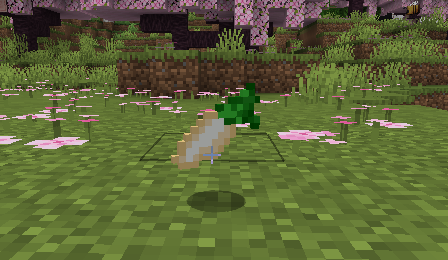
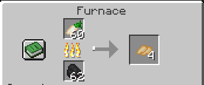

# Elven Tools
*A minecraft mod*
## Instalation instructions
### Through gradle
#### Step 1
Clone the repository
```Bash/Zsh
$ git clone https://github.com/coffeefueld/ElvenTools
```
#### Step 2
Run the client
```Bash/Zsh
$ ./gradlew runClient
```
### Through the .jar file
Download the .jar file and place it in the mods directory of your minecraft forge mods.
## Lore
Thousands of years ago, elves roamed the world. Long before they were banished to the Nether, the piglins and the elves lived together in harmony, but everything changed when the piglins attacked. The ensuing war was long, the battles brutal and bloody. Both sides took heavy losses, but the elves were hit the hardest; unprepared as they were for such a war, their forces held the lines for as long as they could but eventually retreated against the hordes of the piglin armies. As the war waged, more and more cities were lost as the elves were forced to retreat further into their kingdom.

In one of the final battles, fought on the field on the outskirts of one of the last elven cities that hadn't fallen, the Grand General Theodora made her last stand. The elves had been holding the lines for days, scrambling to reform the front line as the piglins battered their depleting army with their hordes of beasts, and waiting for reinforcements. Theodora, looking at her soldiers now dying around her, realised they wouldn't last until the reinforcements came. In a desperate, last attempt to save her people, Theodora ordered all but her most trusted and beloved warriors to retreat.Together they gathered, rallying every last drop of their magic, and performed an ancient, powerful spell. It was madness, a fool's wish, but as the piglin armies were gathering around them, it worked. With the last bits of their magic and their lifeblood, Theodora and her warriors cast a protective spell, a shield, over the city that made it invisible and deflected attacks. The shield held for two days and two nights, giving the elves valuable time to gather the little that remained of their forces. On the eve of the third day, the reinforcements had arrived. The elves fought hard and with renewed vigour, managing to push back the pigling forces and thus starting the streak of victories for the elves that led to the end of the war.In the aftermath, the remaining piglings were exiled to the Nether as the new treaty demanded.

From then on, the elves decided to keep themselves and their cities hidden, allowing no outsiders in. In honour of their fallen General they started making protective charms and amulets named after her that grant the wearer speed, invisibility, resistance, and luck, symbolising her sacrifice and making sure she is never forgotten. Only a handful of elves decide to venture outside the walls of their gilded cities, disguising themselves as traders and travelling the world, selling their wares.

## Features
### - Ruby Ore Block
We've added a mineable ruby ore that spawns 7 veins of three per chuck at y levels 75 to 0. 
### - Ruby
Ruby item that the player can get by smelting or blasting the ruby ore block. They can also get it by un-crafting a ruby block.
<p align="center">
  
</p>
<p align="center">
  
</p>

<p align="center">
  
</p>
### - Ruby Block
Ruby block that can be crafted from 9 ruby items.
<p align="center">
  
</p>
<p align="center">
  
</p>

### - Elven Bread
Elven bread slice that can be purchased from the wandering trader using gold coins. It gives the player 8 saturation and 8 nutrition.
<p align="center">
  
</p>

### - Elven Parsnip
We've added and elven parsnip crop that, when fully grown, drops 2 to 5 parsnips, and 1 parsnip if it's broken before its ready to be harvested. The elven parsnips can be purchased from the wandering trader using gold coins and planted. When eaten it gives the player 1 nutrition and 2 saturation.
<p align="center">
  
</p>

### - Roasted Elven Parsnip
Elven parsnips can be smelted and smoked to produce roasted parsnips. When eaten it gives the player 4 nutrition and 3 saturation.
<p align="center">
  
</p>
<p align="center">
  
</p>

### - Elven Cherry Tomatoes
Elven cherry tomatoes can be purchased from the wandering trader using gold coins. When eaten they give the player 3 nutrition and 2 saturation.
<p align="center">
  
</p>

### - Elven Cherry Tomatoes Seeds
The elven cherry tomatoes seeds can be purchased from the wondering trader using gold coins and planted. The elven cherry tomatoes crop, when fully grown, drops 1 elven cherry tomatoes item and 1 to 3 seeds, and 1 seed if broken before it's ready to be harvested.
<p align="center">
  
</p>

### - Parsnip And Potato Stew
Can be purchased from the wandering trader using gold coins, as well as crafted using a shapeless recipe consisting of roasted elven parsnip, elven cherry tommatoes, baked potatoes, cooked mutton and a bowl. When eated it returns an empty bowl, and gives the player 3 saturation, 15 nutrition, and level 2 regenaration for 8 minutes.
<p align="center">
  
</p>
<p align="center">
  
</p>

### - Gold Coin
Can be crafted using 8 gold nuggets and 1 copper ingot, it's used to purchase common items from the wandering trader.
<p align="center">
  
</p>
<p align="center">
  
</p>

### - Gold And Ruby Coin
Can be crafted from a gold coin and a ruby and is used to purchase rare items from the wandering trader.
<p align="center">
  
</p>

### - Gold And Emerald Coin 
Can be crafted from a gold coin and an emerald and is used to purchase rare items from the wandering trader.
<p align="center">
  
</p>

### - Gold and Star Coin
Can be crafted from a gold coin and a nether star and is used to purchase the Theodora charm from the wandering trader.
<p align="center">
  
</p>

### - Theodora Charm
Protective charm that gives the player luck level 2 and ,when held, speed level 3, invisibility level 2, and resistance level 3.

### - Theodora Amulet 
Can be crafted using the Theodora charm and four chains, has the same atributes as the Theodora charm.
<p align="center">
  
</p>

### - Summoning Crystal
Can be found in dunegeon, pyramid, nether fortresses chests and in more structures around the world. When used it will summon the Wandering Trader.
### Elven Sword
Made from elven steel and emits light, can be purchased from the wandering trader using gold and ruby or gold and emerald coins. There are two variations of the weapon.

**Fist Variation:** Has 19 attack damage and 2.5 attack speed

**Second Variation** Has 21 attack damage and 1.8 attack speed
### Elven Rapier
Made from elven steel, can be purchased from the wandering trader using gold and ruby or gold and emerald coins. There are two variations of the weapon.

**Fist Variation:** Has 13 attack damage and 6 attack speed

**Second Variation:** Has 14 attack damage and 5.5 attack speed
### Elven Pickaxe
Made from elven steel, can be purchased from the wandering trader using gold and ruby or gold and emerald coins. There are two variations of the tool.

**Fist Variation:** Has 8 attack damage and 1.2 attack speed

**Second Variation:** Has 12 attack damage and 0.5 attack speed
